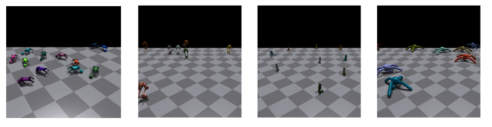

# Dribbling Benchmark Environments

This repository provides an implementation of the paper:

**DexDribbler: Learning Dexterous Soccer Manipulation via Dynamic
Supervision**

[[Paper]](https://arxiv.org/abs/2403.14300)|[[Website]](https://sites.google.com/view/dex-soccer-dribbler/home)

Our work is greatly inspired by [DribbleBot](https://github.com/Improbable-AI/dribblebot) and built upon [IsaacGymEnvs](https://github.com/NVIDIA-Omniverse/IsaacGymEnvs).


## Installation

### Isaac Gym

Download the Isaac Gym Preview 4 release from the [website](https://developer.nvidia.com/isaac-gym), then
follow the installation instructions in the documentation. We highly recommend using a conda environment to simplify set up.

Ensure that Isaac Gym works on your system by running one of the examples from the `python/examples` directory, like `joint_monkey.py`. Follow troubleshooting steps described in the Isaac Gym Preview 4 install instructions if you have any trouble running the samples.

### Gym Envs

Once Isaac Gym is installed and samples work within your current python environment, install this repo:

```bash
pip install -e .
```

To ensure the environments work properly, please execute the following command:

```bash
python train.py
```

Ants should learn to walk forward as fast as possible.

## Load trained models for evaluation

### Absolute Tracking Error

```bash
python ./script/box_plot.py 
```


data for box plot has already been generated, you can run the experiment script to regenerate.

```bash
bash ./script/test_3x5_dribble.sh
```

### Trajectory Following

```bash
python ./script/traj_plot.py
```


data for trajectory plot has already been generated, you can run the experiment script to regenerate.

```bash
bash ./script/test_2x2_traj.sh
```

## Train your own Dribbler

### DexDribbler(Ours)

basically `DribbleBot` + `estimate more context parameter` + `dynamic feedback supervision`

```bash
python train.py task=Go1Dribble train=Go1DribblePPOsea seed=42 
```

### DribbleBot+

`dynamic feedback supervision` disabled, only `DribbleBot` + `estimate more context parameter`

```bash
python train.py task=Go1Dribble train=Go1DribblePPOsea seed=42 ~task.env.rewards.rewardScales.tracking_lin_vel_PID ~task.env.rewards.rewardScales.raibert_heuristic_PID
```

### DribbleBot (Baseline)

original `DribbleBot`, but extend the lower bound of ball-terrain-drag from `0.1` to`-0.1`

```bash
python train.py task=Go1Dribble train=Go1DribblePPOsea seed=42 ~task.env.rewards.rewardScales.tracking_lin_vel_PID ~task.env.rewards.rewardScales.raibert_heuristic_PID ~task.env.priviledgeStates.ball_states_v_1 ~task.env.priviledgeStates.ball_states_p_1 ~task.env.priviledgeStates.ball_states_v_2 ~task.env.priviledgeStates.ball_states_p_2 ~task.env.priviledgeStates.dof_stiff ~task.env.priviledgeStates.dof_damp ~task.env.priviledgeStates.dof_calib ~task.env.priviledgeStates.payload ~task.env.priviledgeStates.com ~task.env.priviledgeStates.friction ~task.env.priviledgeStates.restitution ~task.env.priviledgeStates.ball_mass ~task.env.priviledgeStates.ball_restitution
```

### Reproducibility

the random seeds we used in the experiment part of the paper are `[42,3,13,17,69,106]`.

### Dribbling under other leg configuration



By simply adapting the action dimension and specifying the foot index number, our training pipeline and the original DribbleBot approach are both naturally compatible for ball dribbling tasks across different legged robot configurations.

you can try:
```
python train.py task=NaoDribble train=Go1DribblePPOsea
```
or

```
python train.py task=CaDribble train=Go1DribblePPOsea
```

But they are not verified in real world.

## Citing

Please cite this work as:

```
@misc{hu2024dexdribbler,
      title={DexDribbler: Learning Dexterous Soccer Manipulation via Dynamic Supervision}, 
      author={Yutong Hu and Kehan Wen and Fisher Yu},
      year={2024},
      eprint={2403.14300},
      archivePrefix={arXiv},
      primaryClass={cs.RO}
}
```
